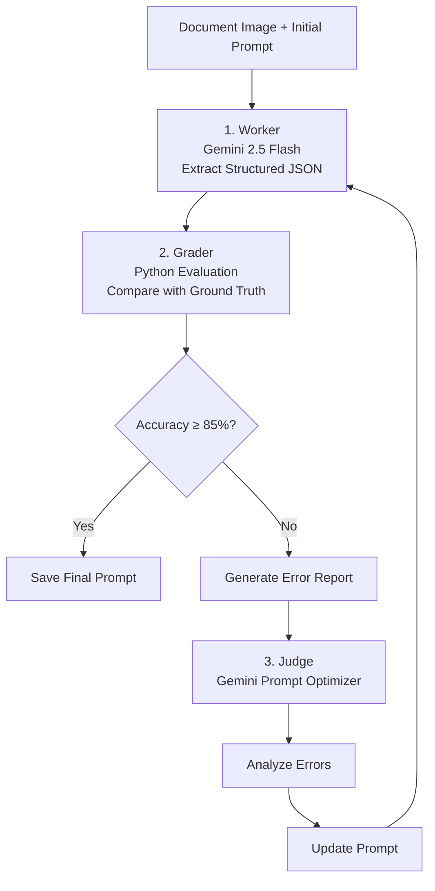

# PromptEvolve: Self-Optimizing Document Parsing with Gemini

PromptEvolve explores whether an LLM can improve its own prompts through an automated feedback loop. Instead of manually tuning prompts, the system evaluates each extraction against a ground-truth dataset and refines its own prompt based on previous mistakes.

The project implements a **Worker–Grader–Judge** architecture:

- **Worker** extracts structured JSON from document images using Gemini 2.5 Flash.
- **Grader** compares the output with the ground-truth annotations and calculates an accuracy score.
- **Judge** analyzes recurring errors and rewrites the system prompt for the next iteration.

---

# Results

**Dataset**
- FUNSD (Form Understanding in Noisy Scanned Documents) from Hugging Face

**Accuracy**
- Initial prompt: **65%**
- Final prompt: **78%**

**Prompt Evolution**
- Total generations: **3**

> **Experiment note:** This demo was intentionally limited to three optimization rounds because it was developed using the Gemini 2.5 Flash free-tier API. The framework supports additional iterations when higher API quotas are available.

---

# Why?

Traditional document extraction pipelines usually separate OCR from text parsing. While this works well for clean documents, it often struggles with handwritten text, multi-column layouts, and visually complex forms.

PromptEvolve approaches document parsing as a multimodal task. Instead of relying on OCR text alone, Gemini processes the document image directly and improves its extraction prompt through an automated feedback loop.

---

# Architecture

The framework implements an iterative prompt optimization loop.



---

# How It Works

### 1. Structured Output

Gemini is constrained with a Pydantic schema (`ExtractedForm` → `KeyValuePair`) to ensure consistent JSON output.

### 2. Document Parsing (Worker)

The Worker receives the document image together with the current system prompt and extracts structured key-value pairs using Gemini 2.5 Flash.

### 3. Evaluation (Grader)

A Python evaluator compares the extracted JSON against the FUNSD ground-truth annotations and computes an accuracy score while recording missing or incorrect fields.

### 4. Prompt Refinement (Judge)

When the target accuracy is not reached, the Judge analyzes the evaluation results and updates the system prompt with more specific extraction instructions. The refined prompt is then used in the next generation.

---

# Tech Stack

- Python
- Gemini 2.5 Flash
- Google GenAI SDK
- Pydantic
- Hugging Face Datasets

---

# Implementation Details

- Structured JSON output with Pydantic
- Automatic prompt refinement
- Ground-truth dataset evaluation
- Iteration logging
- Gemini multimodal document parsing

---

# Key Takeaways

- Built a multimodal document parser using Gemini 2.5 Flash.
- Designed a Worker–Grader–Judge feedback loop for automatic prompt optimization.
- Evaluated prompt quality using the FUNSD benchmark.
- Improved extraction accuracy from **65%** to **78%** without manually rewriting prompts.

---

# Setup

## Prerequisites

```bash
pip install google-genai pydantic pillow datasets -q
```