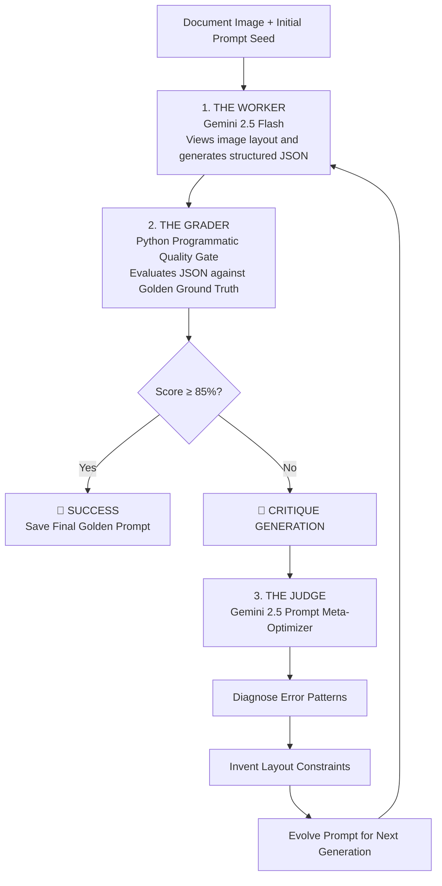

# 🚀 FormEvolve-AI: Multimodal Form Parser with Prompt Self-Evolution Loop

An intelligent, production-ready document processing framework leveraging **Gemini 2.5 Flash** and **Pydantic Structured Outputs**. It extracts clean, structured JSON data directly from complex, noisy document forms without relying on traditional, fragile OCR text-splitting pipelines. 

The core innovation of this project is an automated **"Worker-Grader-Judge" Prompt Self-Evolution Loop**—an optimization architecture that analyzes its own extraction errors, learns layout anomalies, and dynamically re-engineers its own system instructions until it achieves flawless accuracy.

---

## The Enterprise Pain Point & Our Solution

Traditional Intelligent Document Processing (IDP) frameworks rely on a fragile two-step pipeline: **OCR Text Extraction ➔ Text-based NLP Parsing**. This approach brittlely breaks down when encountering complex spatial layouts, handwriting, horizontal alignment shifts, or inline tabular lists.

**FormEvolve-AI** solves this by treating form parsing as a unified multimodal task. Gemini directly looks at the document image, comprehends layout and text concurrently, and runs an automated feedback loop to perfect its parsing instructions on the fly without any manual prompt tuning.

---

## Core System Architecture & Iterative Workflow

The framework implements a meta-cognitive optimization loop featuring three synchronized architectural roles collaborating iteratively:




### 🧱 Detailed Step-by-Step Execution

1. **Phase 1 - Structured Schema Binding**: The system binds Gemini's response directly to a strict Pydantic contract (`ExtractedForm` containing a list of `KeyValuePair`). This forces the LLM to output predictable, clean JSON arrays while filtering out conversational conversational noise.
2. **Phase 2 - Multimodal Execution (The Worker)**: The Worker takes the image and the *current generation prompt* to perform visual entity extraction at a very stable temperature ($0.1$) to maximize consistency.
3. **Phase 3 - Programmatic Quality Gate (The Grader)**: A deterministic Python grading function intersects the Worker's JSON against a human-verified **Golden Ground Truth dataset**. It outputs an exact mathematical accuracy score and standardizes missing fields into a structured error log.
4. **Phase 4 - Prompt Mutation & Evolution (The Judge)**: If accuracy targets are unmet, the Judge agent interprets the raw error strings. Acting as an expert Prompt Engineer, it auto-mutates the prompt text, embedding custom instructions (e.g., *specifying column rules, handling complex inline list colons, or scanning independent boundary stamps*), and feeds the upgraded prompt back into Phase 2 after a safety cooldown.

---

## Advanced Technical Highlights Included in the Script

* **Knowledge Distillation Design**: Showcases a production-level architecture where high-tier conceptual verification (Golden Dataset) is used to systematically upgrade cheaper, low-latency models (`Gemini 2.5 Flash`).
* **Production Rate-Limiting**: Implements proactive telemetry pauses (`time.sleep(6)`) within loops to perfectly respect Google Free-Tier API thresholds (15 RPM limits) without crash failures.
* **Inline Dynamic List Generalization**: Includes general prompt injection semantics capable of extracting multi-identifier horizontal line-items (`"Item Name" Code :Metric`) without corrupting string splits or dropping numeric metrics.
* **Full Iteration History Auditing**: Caches a robust log dictionary compiling exact tracking metrics, grading outcomes, and prompt transformations across generations, providing comprehensive observability.


---

## Setup & Local Quickstart

### Prerequisites
Install the modernized Google GenAI SDK, data schemas, and vision libraries:
```bash
pip install google-genai pydantic pillow datasets -q